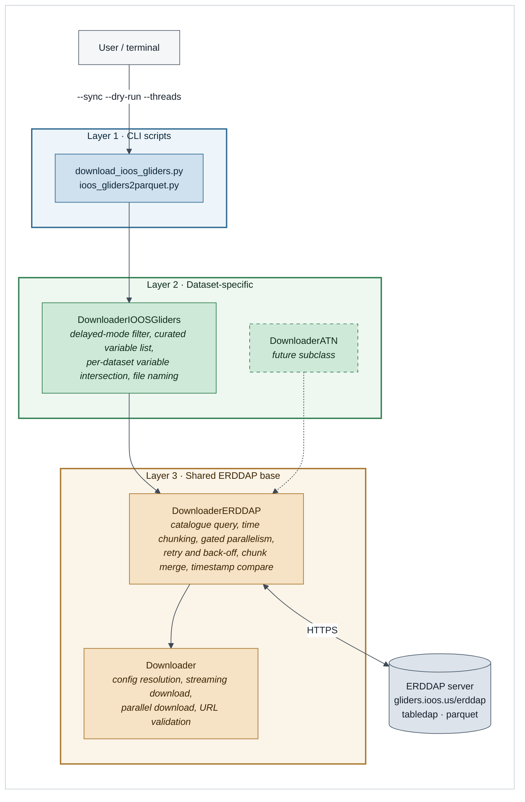
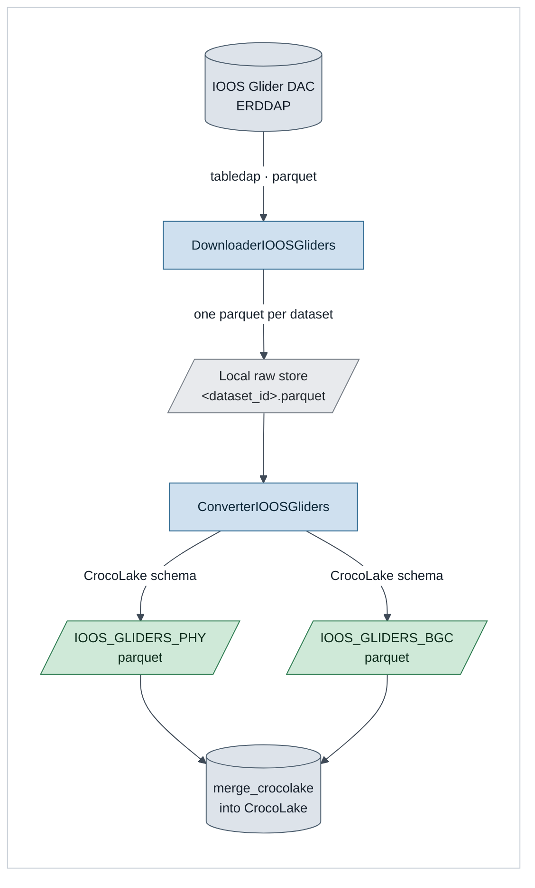
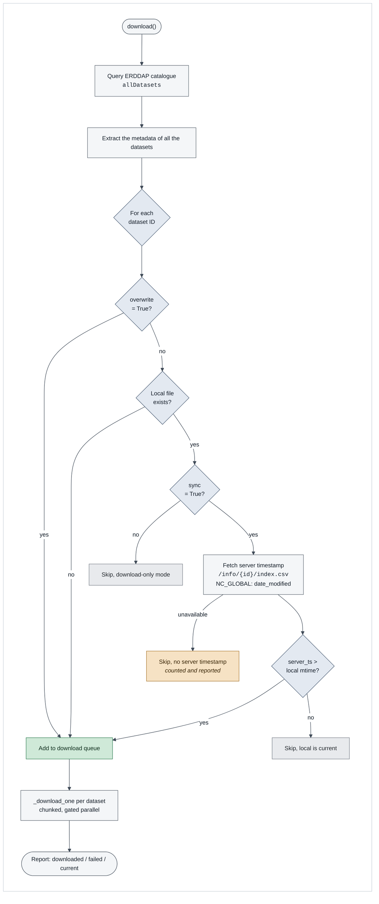
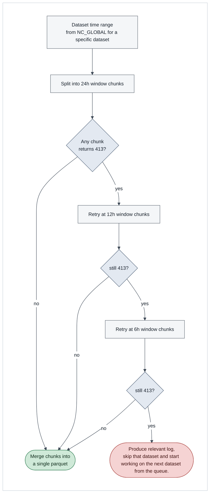
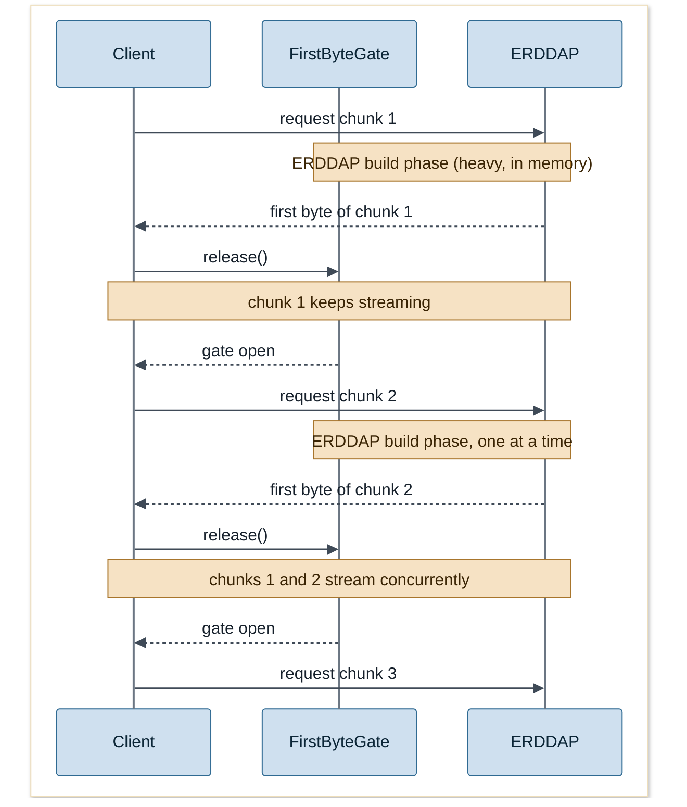
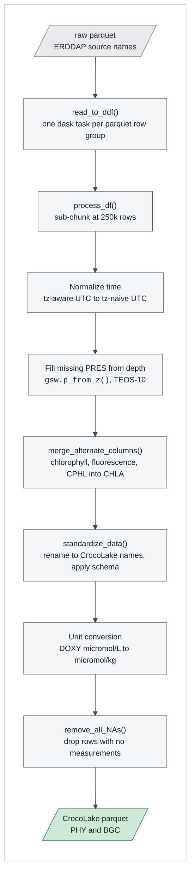

# Google Summer of Code 2026, Final Work Product

## Enhancing CrocoLakeTools with IOOS Data Sync from ERDDAP

| | |
|---|---|
| **Contributor** | Mahi Sarwar Anol ([@mahi-anol](https://github.com/mahi-anol)) |
| **Organization** | [IOOS](https://ioos.us/), U.S. Integrated Ocean Observing System |
| **Project** | [Project #5: Enhancing CrocoLakeTools with IOOS Data Sync from ERDDAP](https://github.com/ioos/gsoc/issues/118) |
| **Mentors** | [Enrico Milanese](https://github.com/enrico-mi) |
| **Repository** | [boom-lab/crocolaketools-public](https://github.com/boom-lab/crocolaketools-public) |
| **Project size** | 175 hours (Medium) |
| **Coding period** | 25 May 2026 to 24 August 2026 |
| **Proposal** | [gsoc-proposal.pdf](./gsoc-proposal.pdf) |
| **Community meeting slide deck** | [IOOS GSoC 2026 Project Update slide](https://docs.google.com/presentation/d/1tKegfeylG6uyAgWYfbfcaXzX9pQ2IddU/edit?usp=sharing&ouid=111822028930372984807&rtpof=true&sd=true) |

---

## 1. Abstract

[CrocoLake](https://crocolakedocs.readthedocs.io/) is a harmonized database of oceanographic observations. It is built by [CrocoLakeTools](https://github.com/boom-lab/crocolaketools-public), a Python package that downloads raw data from upstream providers and converts it into a single CrocoLake-compliant parquet common schema.

Every downloader in CrocoLakeTools used to be static. It either fetched one fixed file from one fixed URL, as the GLODAP downloader does, or walked a hard-coded list of filenames, as the Spray Gliders one does. For a frozen snapshot that is fine. For a live data server it is not.

The [IOOS Glider DAC](https://gliders.ioos.us/erddap) is a live ERDDAP server. It currently serves more than 2000 delayed-mode and Non delayed-mode glider deployment datasets, new deployments show up continuously, and existing ones get revised as delayed-mode QC finishes in the field. So maintaining a static link to download the IOOS datasets is not a suitable approch.

This project added a general-purpose ERDDAP interaction layer to CrocoLakeTools, along with an incremental sync for the IOOS Glider DAC. The sync queries the catalogue, compares server-side timestamps against what is already on disk, downloads only what is new or changed. These datasets then go through converter pipelines that converts these raw datasets to [crocolake convention](https://crocolakedocs.readthedocs.io/en/latest/crocolake.html#crocolake-s-conventions)

---

## 2. State of the work at the end of GSoC

Everything in the core project scope is implemented, tested and merged. One enhancement and one converter were still in review when I submitted this.

| # | Work item | Status |
|---|---|---|
| [PR #48(crocolaketools)](https://github.com/boom-lab/crocolaketools-public/pull/48) | Base `Downloader` refactor and OleanderXBT downloader rewrite | Merged |
| [issue #467(erddapy)](https://github.com/ioos/erddapy/issues/467) | Upstream: add `parquet` as a supported response format in `erddapy` | Resolved upstream by Filipe(maintainer) |
| [PR #50(crocolaketools)](https://github.com/boom-lab/crocolaketools-public/pull/50) | `DownloaderERDDAP` base class and `DownloaderIOOSGliders` incremental sync | Merged |
| [PR #53(crocolaketools)](https://github.com/boom-lab/crocolaketools-public/pull/53) | Removing the CrocoLakeLoader submodule dependency from CrocoLakeTools | Merged |
| [PR #10(crocolakeloader)](https://github.com/boom-lab/crocolakeloader/pull/10) | Counterpart change in CrocoLakeLoader | Merged |
| [PR #54(crocolaketools)](https://github.com/boom-lab/crocolaketools-public/pull/54) | CI pipeline to keep `db_names.py` in sync across the two repos | Written, blocked on org permissions |
| [PR #59(crocolaketools)](https://github.com/boom-lab/crocolaketools-public/pull/59) | Config-driven custom ERDDAP constraints (all 7 tabledap operators) | In review |
| [PR #65(crocolaketools)](https://github.com/boom-lab/crocolaketools-public/pull/65) | `ConverterIOOSGliders`, IOOS Glider DAC to CrocoLake parquet | In review |
| - | Animal Telemetry Network downloader (stretch goal) | Deferred, see section 7 |

Two earlier PRs, [#41 (GLODAP downloader)](https://github.com/boom-lab/crocolaketools-public/pull/41) and [#45 (Spray Gliders downloader)](https://github.com/boom-lab/crocolaketools-public/pull/45), were coded during the application phase. They were not part of the GSoC deliverables. I am mentioning them because they are the reason the base `Downloader` class already had `download_file()`, `is_already_downloaded()` and `unzip_file()` for this work to build on.

---

## 3. Architecture

### 3.1 The three-layer design

The architectural decission came out from the discussion I had at [issue #118](https://github.com/ioos/gsoc/issues/118) during the application phase, where my mentor Enrico and I agreed to keep three things apart:

1. what the user interacts with. 
2. what is specific to one dataset or source. 
3. what every ERDDAP source needs commonly. 

Our discussion took a turn around a three layered architecture that goes as following: 



### 3.2 End-to-end data flow



---

## 4. The sync mechanism

This is the core deliverable. Every dataset in a sync run ends up in exactly one of four states.



The comparison reads `NC_GLOBAL` from the ERDDAP `info` endpoint, trying `date_modified` first, then
`date_created`, then `date_issued`, and checks whatever it finds against the local file's
modification time. If none of the three is there, the dataset is not quietly skipped: it gets counted
and printed in the run summary. A gap in the server's metadata should not be able to turn into stale
local data without anyone noticing.

`--dry-run` walks the same decision tree and prints what it would fetch without issuing a single data
request, which makes it possible to reason about an 863-dataset sync before starting one.

---

## 5. Engineering challenges and Solutions

Most of the work here was not the sync logic, which is fairly mechanical once the decision is settled. It was getting a bulk download to run against a real shared, memory-constrained ERDDAP server without making it worse for everyone else using it.

### 5.1 ERDDAP caps response size (HTTP 413)

Fetching a multi-month glider deployment in one request causes http 413 error which was caused due to exceeding payload size limit of the erddap server. During my experiments I found anything much over 35 MB fails.

To solve that I implemented time-windowed chunking with an adaptive step-down. The downloader reads `time_coverage_start` and `time_coverage_end` for the dataset, splits that range into windows, fetches each one separately, and merges them locally into a single parquet file. If a window still comes back 413, the whole dataset is retried at the next window size down.



Chunks are downloaded in a per-dataset temporary directory, get sorted by index, concatenated, sorted by `time`, and only then written to the final path. If any chunk fails, the merge is abandoned and nothing is written at all. A half-downloaded dataset that looks complete on disk is worse than a visible failure, because the next sync run would look at its mtime and call it current.

### 5.2 Naive parallelism took the server down

My first parallel implementation was the obvious one: four workers, four concurrent requests. Against the live DAC that pushed the server past its memory limit, produced sustained 503s, and at one point during testing left it completely unresponsive.

The reason is in how ERDDAP serves tabledap. It builds the entire response in memory before sending the first byte, so four concurrent requests means four full responses being materialized at the same time. The transfer phase costs almost nothing. The build phase is what runs the server out of memory.

So the throttle belongs on the build phase rather than on requests. A new chunk request is allowed to start once the previous chunk receives its first byte, which is proof that its build has finished and it has moved into streaming. Transfers after that overlap freely.



Builds end up serialized and transfers stay parallel. The server never holds more than one full
response in memory, and the client keeps most of the throughput it would get from plain concurrency.
`FirstByteGate` is a `threading.Semaphore` starting at 0, with a `threading.Event` around the
callback so the gate is released exactly once per chunk, whether that chunk succeeded, failed, or
came back as an empty window.

The behaviour is configurable. Setting `gated_parallel_download: false` swaps in a `NoOpGate` with an
identical interface, so an ERDDAP server with different memory characteristics can run unrestricted
parallelism bounded only by `num_threads`, without any change to download code.

### 5.3 Error handling: which signals mean what

I mapped every HTTP status the DAC produces to a deliberate response instead of wrapping everything
in one generic retry.

| Signal | What it actually means | How the downloader handles it |
|---|---|---|
| **HTTP 413** | Single response too large | Re-chunk smaller: 24h, then 12h, then 6h |
| **HTTP 503** | Server out of memory or overloaded | Back off and retry at 15s, 30s, 60s |
| **HTTP 429** | Too many requests per unit time | Same retry-with-back-off path |
| **HTTP 500** | Transient server-side failure | Same retry-with-back-off path |
| **ReadTimeout** | Build slower than the client timeout | Read timeout raised to 600s, then retry |
| **ChunkedEncodingError, ConnectionError** | Connection dropped mid-transfer | Retry with back-off, partial `.tmp` discarded |
| **HTTP 404** | Empty time window, no data in range | Not an error. Skip the window, count it, keep going |

The 404 row is the one worth explaining. A glider that surfaced for a day in the middle of a
deployment leaves time windows with genuinely no observations in them. Treating those as failures
would abort otherwise-good datasets, so they are counted and reported as "empty window(s) skipped".

Downloads stream to a `.tmp` file and are renamed with `os.replace()` on success, so an interrupted
run cannot leave behind a corrupt file that a later sync mistakes for valid data.

### 5.4 Roughly 3,500 unique variables across the catalogue

Variable naming across glider deployments is a mess. The same measurement turns up as `chlorophyll`,
`chlorophyll_a`, `fluorescence`, `sci_c3sfl_chlorophyll` or `CPHL` depending on the manufacturer, the
sensor model and the vendor's firmware. Asking for everything wastes bandwidth. Asking for a fixed
list gets a 400 back from any dataset that happens to be missing one of the variables.

Two things solve it.

1. **A curated variable list.** I inventoried every variable in the catalogue by frequency
   (`variable_frequency.json`, PR #50) and mapped them by hand against the
   [CrocoLake conventions](https://crocolakedocs.readthedocs.io/en/latest/crocolake.html#crocolake-s-conventions).
   That produced about 130 source names, covering parameters and their `_QC` flags, for PHY (`TEMP`,
   `PSAL`, `PRES`) and BGC (`DOXY`, `CHLA`, `CDOM`, `BBP470/532/700`, `TURBIDITY`, `NITRATE`,
   `PH_IN_SITU_TOTAL`, `DOWNWELLING_PAR`, and the irradiance and radiance channels). Each alias has
   an inline comment naming the sensor it comes from, so whoever maintains this next can see why
   `sci_oxy4330f_oxygen` is on the list.

2. **A per-dataset intersection.** Before building a URL, the downloader asks the `info` endpoint
   what variables that dataset actually has and requests only the overlap with the curated list. That
   is what keeps the 400s away, and it degrades gracefully: if the `info` call itself fails, it falls
   back to the full list and lets ERDDAP decide.

### 5.5 erddapy did not support parquet

The IOOS Glider DAC serves parquet natively, but `erddapy`'s client-side `download_formats` allowlist
rejects `file_type="parquet"` in `to_download()`. `get_download_url(response="parquet")` skips that
check and builds a valid URL, which is the workaround the downloader uses.

`erddapy` is maintained by IOOS, the same organization hosting this project, so the better place for
the fix was upstream. I opened [ioos/erddapy#467](https://github.com/ioos/erddapy/issues/467) to add
parquet to the supported formats, and Filipe Fernandes reviewed and resolved it.

### 5.6 Why gliderpy was not the right tool

`gliderpy` wraps `erddapy` and looks like the natural choice. I read its source and ruled it out on
two counts:

- `query()` hard-codes `search_for="glider"`. Reaching any other ERDDAP dataset type, animal
  telemetry or moorings for instance, would mean forking the package, which works against the whole
  reusability argument for the three-layer design.
- `query()` also defaults to `delayed=False`, which filters delayed-mode datasets *out*. Those are
  exactly the datasets this project is about.

I used `erddapy` directly instead, and kept `gliderpy` around as a reference for what a clean query
interface looks like.

### 5.7 Untangling the CrocoLakeLoader submodule dependency

CrocoLakeTools pulled its database names and parameter mappings from CrocoLakeLoader's `params.py`
through a git submodule. To run the converters, a contributor had to clone and initialize a second
repository, and renaming anything shared broke the other repo without warning.

[#53](https://github.com/boom-lab/crocolaketools-public/pull/53) and
[crocolakeloader#10](https://github.com/boom-lab/crocolakeloader/pull/10) moved the shared
definitions into `crocolaketools/db_names.py` and `crocolaketools/db_params.py`, 1,037 lines in
total, and updated every converter, downloader and test to the new import path. I also wrote a GitHub
Actions workflow that detects drift between the two repos' copies of `db_names.py`. It is ready to
enable, but it needs organization-level permissions to run across both repositories.

---

## 6. The converter: IOOS Glider DAC to CrocoLake

The sync was merged ahead of schedule, so Enrico and I agreed to put the remaining time into the
downstream half of the pipeline: turning the downloaded parquet into CrocoLake's schema, without
which the data cannot actually enter CrocoLake.



A few decisions in here are not obvious from the code alone.

The 250k-row sub-chunking is not arbitrary. The BGC schema is around 120 columns wide, and
standardizing a full 1M-row parquet row group in one go exceeds the dask worker memory limit. The
sub-chunks run sequentially on purpose: parallelism already comes from the per-row-group tasks, and
parallelizing here would bring the memory pressure straight back.

Alternate columns are merged before renaming, because several source names collapse into a single
CrocoLake variable, first non-null winning in map order. Rename first and you end up with duplicate
columns. Pressure is derived from depth in the same phase, using `gsw.p_from_z()` with latitude
(TEOS-10), for deployments that record only depth or whose pressure record is sparse.

QC flags pass through untouched. The IOOS Glider DAC uses the same 0 to 9 flag convention as Argo, so
re-mapping them would add risk and buy nothing. There is a comment in the code saying so, so it does
not read as something I forgot.

Finally, `overwrite` and `overwrite_pq` are deliberately separate config keys. `overwrite` belongs to
the downloader and forces a re-download; `overwrite_pq` controls whether converted output is
replaced. One shared key would mean a re-download flag quietly deciding whether converted output gets
clobbered.

---

## 7. What is not done, and why

Whoever picks this up needs this section more than any other.

- **Animal Telemetry Network downloader (stretch goal), not done, deliberately.** Writing the
  subclass was never the risky part; the three-layer design keeps it small. The blocker is
  scientific. The variables in the ATN ERDDAP catalogue do not map onto CrocoLake's conventions, so a
  downloader would produce data the converter has nowhere to put, which amounts to shipping a
  component with no consumer. The mapping question needs settling with the CrocoLake maintainers
  first.
- **The `db_names.py` sync CI pipeline is written but not switched on.** It needs organization-level
  permissions across `boom-lab/crocolaketools-public` and `boom-lab/crocolakeloader`. The workflow
  itself is finished; turning it on is an administrative step.
- **[PR #59](https://github.com/boom-lab/crocolaketools-public/pull/59) (config-driven constraints)
  is in review**, not merged, as of submission.
- **`ConverterIOOSGliders` is in review** on `feature/IOOS-GDAC-Converter`.
- **Full-catalogue production run.** I have run the downloader against the live DAC across all 863
  delayed-mode datasets and verified the sync, skip and queue logic, but a complete end-to-end ingest
  of every dataset into CrocoLake is an operational run for the maintainers, not a GSoC deliverable.

---

## 8. Usage

```bash
# install (from the repository root)
pip install -e .

# sync delayed-mode glider datasets, using config.yaml settings
download_ioos_gliders --config --sync

# see what a sync would do, without downloading anything
download_ioos_gliders --config --sync --dry-run

# force a full re-download with 8 parallel threads
download_ioos_gliders --config --overwrite --threads 8

# convert downloaded parquet into CrocoLake schema (PHY, BGC, or both)
ioos_gliders2parquet --config -t both
```

Configuration lives in `crocolaketools/config/config.yaml` under `IOOS_GLIDERS_PHY` and
`IOOS_GLIDERS_BGC`:

```yaml
IOOS_GLIDERS_PHY:
  db: IOOS_GLIDERS
  db_type: PHY
  server_url: https://gliders.ioos.us/erddap
  response_format: parquet
  input_path: ../demo/demo_IOOSGliders/
  delayed_only: true
  sync: true                     # compare timestamps and re-download updated datasets
  overwrite: false               # force full re-download (downloader)
  num_threads: 4
  gated_parallel_download: true  # one chunk in ERDDAP's build phase at a time
  constraints:                   # all 7 tabledap operators supported: = != =~ < <= > >=
    time>=: "2015-01-01T00:00:00Z"
    time<=: "2026-01-01T00:00:00Z"
    latitude>=: -90.0
    latitude<=:  90.0
    longitude>=: -180.0
    longitude<=: 180.0
  overwrite_pq: true             # overwrite converted output (converter)
```

`time>=` and `time<=` clamp the chunking window so only the requested period is fetched at all. Every
other constraint goes to ERDDAP on each chunk request and is applied server-side before any data
moves, which matters a great deal when a regional subset turns a multi-GB deployment into a few MB.

---

## 9. Testing

| Test module | Tests |
|---|---|
| `test_downloaderIOOSGliders.py` | 34 |
| `test_downloaderOleanderXBT.py` | 15 |
| `test_downloaderGLODAP.py` | 18 |
| `test_downloaderSprayGliders.py` | 14 |

The coverage is aimed at the paths that are painful to reproduce by hand: URL construction with and
without constraints, delayed-mode filtering, all four sync branches, timestamp parsing across the
three `NC_GLOBAL` fallbacks and several date formats, window splitting, the 413 step-down schedule,
per-status retry and back-off, 404-as-empty-window, chunk merge ordering, and the
abort-on-partial-failure guarantee. Server interaction is mocked throughout, so the suite never
depends on the live DAC or hammers it. Integration behaviour was checked separately against the real
server.

---

## 10. Timeline

Set against the schedule in the proposal, period by period.

| Period | Planned in the proposal | What actually happened |
|---|---|---|
| **1 to 24 May**<br/>Community bonding | Finish the OleanderXBT refactor, read the tabledap documentation, probe the `info` endpoint, agree the `DownloaderIOOS` interface with Enrico | As planned. PR #48 was opened 30 March and merged 13 May, so the base-class refactor was in place before coding started |
| **25 May to 7 June**<br/>Weeks 1 and 2 | Add `download_parallel()` to the base class, connect through `erddapy`, resolve parquet URLs, unit tests | Done, and then some. The 413 ceiling and the 503 crash both surfaced on the first catalogue-scale run, so chunking, retry and the first-byte gate got built here instead of in weeks 7 to 10 |
| **8 to 21 June**<br/>Weeks 3 and 4 | `DownloaderIOOSGliders`: delayed-mode filter, local file discovery, timestamp comparison, tests for all sync cases | Done, tests landed 18 June. The `db_names` and `db_params` decoupling began 15 June as unplanned work, once the submodule turned out to be a barrier for contributors |
| **22 June to 5 July**<br/>Weeks 5 and 6 | CLI script with `--overwrite`, `--dry-run` and `--threads`, config section, entry point, end-to-end run | Done. Also refactored `DownloaderERDDAP` and rebuilt the variable list against CrocoLake conventions after inventorying the catalogue's ~3,500 variables |
| **6 to 10 July**<br/>Midterm | Midterm evaluation, buffer for review feedback | PR #53 merged 6 July. PR #50 merged 16 July |
| **11 to 26 July**<br/>Weeks 7 and 8 | Edge cases: timeouts, partial downloads, missing metadata, rate limiting, retry back-off | Already complete, built in weeks 1 and 2. The time went to config-driven ERDDAP constraints instead, PR #59 |
| **27 July to 9 August**<br/>Weeks 9 and 10 | Expand error-path test coverage, polish | Done, 34 tests on the IOOS downloader. Started `ConverterIOOSGliders`, which was not in the proposal at all |
| **10 to 16 August**<br/>Week 11 | ATN stretch goal, otherwise finalize documentation | Converter work continued. ATN deferred for the reason given in section 7 |
| **17 to 24 August**<br/>Final | Final review, submit work product | Documentation and final submission |

What the table mostly shows is that hardening moved forward by about six weeks. The proposal assumed
error handling would be its own late phase. In practice the server's real failure modes turned up on
the first run at catalogue scale and had to be dealt with before anything else could move. The weeks
that opened up went into the CrocoLakeLoader decoupling and the converter, after discussing it with
Enrico, instead of the ATN stretch goal.

---

## 11. What I learned

Nothing about the 35 MB ceiling, the build-before-send memory model, or 404 meaning "empty window"
appears in any documentation I could find. I found all three by firing requests at the live DAC and
reading the responses carefully. In hindsight, the most useful thing I did all summer was spend
community bonding writing throwaway scripts to poke at the server before writing any production code.

The two guarantees I am most attached to, `.tmp`-then-`os.replace()` and abort-on-partial-merge, both
exist because of one property of sync tools: a truncated file on disk looks current to the next run.
Local state decides what happens next, so a failure that crashes is much easier to live with than one
that quietly leaves plausible-looking garbage behind.

Taking the DAC down during testing changed how I approached the rest of the project. The easy
response would have been to lower the thread count and move on. Working out *why* it fell over
produced the first-byte gate instead, which is both gentler on the server and faster than what I
started with. Not overloading a shared server turned out to be a design constraint with a real
engineering answer, not just good manners.

The session with Mathew and the IOOS GDAC team was worth far more than the time it took. It confirmed
that the behaviours I had been working around are known, expected ERDDAP characteristics rather than
something broken in my implementation, and that the mitigations I had chosen were already the right
ones. Without that conversation I would probably have spent a week redesigning something that was
already correct.

The parquet workaround was two lines. Filing
[ioos/erddapy#467](https://github.com/ioos/erddapy/issues/467) took considerably longer than writing
it, but the next person will not need the workaround at all.

---

## 12. Post-GSoC plans

I intend to stay in the codebase after GSoC:

- Take [PR #59](https://github.com/boom-lab/crocolaketools-public/pull/59) and
  `ConverterIOOSGliders` through review to merge.
- Enable the `db_names.py` sync CI pipeline once the organization permissions are in place.
- Come back to the ATN downloader once the variable-mapping question is settled with the CrocoLake
  maintainers.
- Keep maintaining the ERDDAP layer as new sources are added. The three-layer design is only worth
  anything if the next dataset is genuinely cheap to add, and I would like to add one and find out.

---

## 13. Acknowledgements

Thank you to **Enrico Milanese** for the design review throughout. The three-layer structure, the
steady pressure to push shared logic down into the base class, and the occasional instruction to
leave a working solution alone instead of polishing it further were all his. Thank you to **Mathew
Biddle** and the **IOOS GDAC team** for the session on ERDDAP's error behaviour, and to **Filipe
Fernandes** for resolving the `erddapy` parquet issue upstream. And thank you to **IOOS** and
**Google Summer of Code** for the opportunity.

---

## 14. Links

| Resource | Link |
|---|---|
| Repository | https://github.com/boom-lab/crocolaketools-public |
| PR #48, base Downloader refactor | https://github.com/boom-lab/crocolaketools-public/pull/48 |
| PR #50, ERDDAP base and IOOS Gliders sync | https://github.com/boom-lab/crocolaketools-public/pull/50 |
| PR #53, CrocoLakeLoader decoupling | https://github.com/boom-lab/crocolaketools-public/pull/53 |
| PR #59, custom ERDDAP constraints | https://github.com/boom-lab/crocolaketools-public/pull/59 |
| crocolakeloader PR #10 | https://github.com/boom-lab/crocolakeloader/pull/10 |
| erddapy issue #467, parquet support | https://github.com/ioos/erddapy/issues/467 |
| CrocoLake documentation | https://crocolakedocs.readthedocs.io/ |
| IOOS Glider DAC | https://gliders.ioos.us/erddap |
| GSoC proposal | [gsoc-proposal.pdf](./gsoc-proposal.pdf) |
